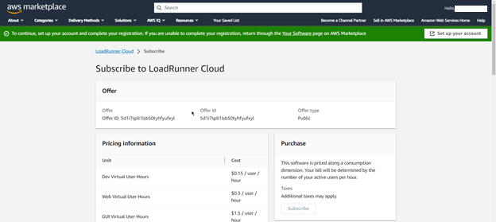
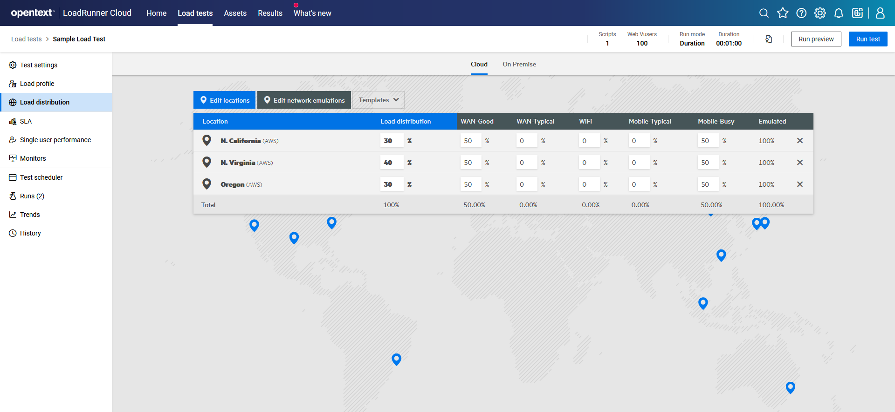
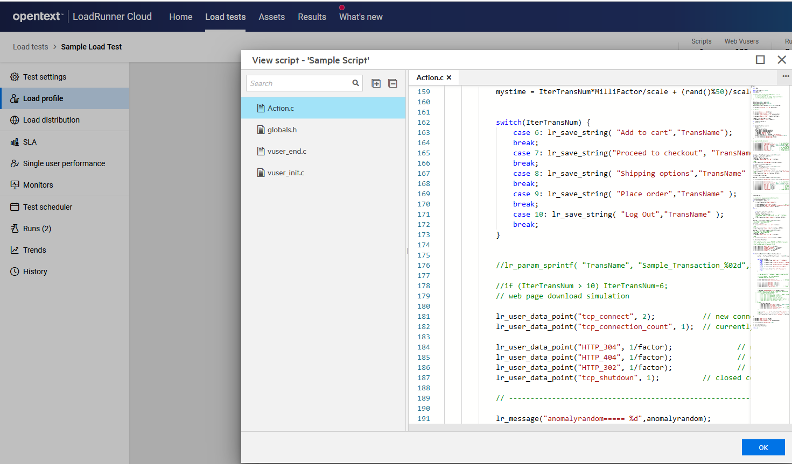
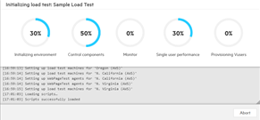
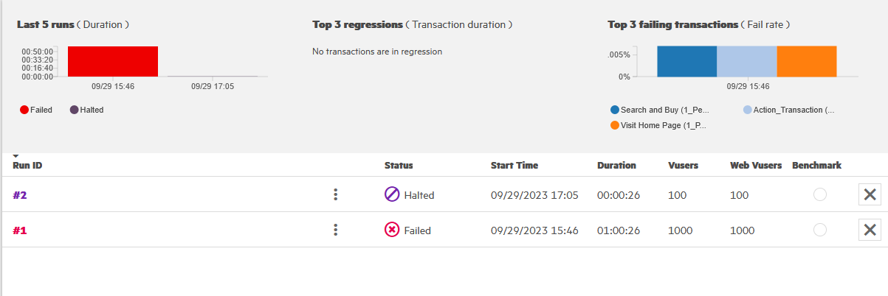

|ToC|
|---|

In the process of preparing to write this article, I learned a lot about load testing of bridges. Load testing a bridge is performed, among others, to verify satisfactory performance of the bridge in accordance with the design intents.

This article is not about load testing of bridges, nor is it about load testing of applications, but I believe that both these concepts have relevance worthy of a brief exploration.

## Why Software Testing in the Cloud?

Cloud technology is no longer being viewed as emerging. Factors that include agility, cost efficiency, resilience, and scalability have led to the wide adoption of cloud. However, factors such as the regulatory scrutiny of cloud, the need to integrate legacy workloads with cloud-native technologies, and traditional methods being proved to be unsuitable for testing in the cloud, ensuring testing methods that are aligned to cloud workloads remains high on the cloud agenda.

## Performance Testing in the Cloud

Performance testing is an “umbrella” term used to define the practice of evaluating how your system responds and its stability under a particular workload. Types of performance testing include load, latency, stress, soak, spike, scalability, just to name a few. I mentioned load testing at the beginning of this article because oftentimes, load testing is compared, or confused, with stress testing. Stress testing is the topic of discussion in this article.

## Load Testing vs Stress Testing

Going back to the bridge analogy that I mentioned at the beginning of this article:

Load testing measures how your system performs under expected load volumes. If the bridge is designed to handle *x* cars over a long period of time as per its design, load testing a bridge would seek to test if the bridge can indeed handle *x* cars over this extended amount of time. Likewise, if your system is designed to handle an *x* number of users (or transactions per second (TPS)) over a long period of time (usually 2 – 3 days) as per its design, load testing a system would test if the system can handle an *x* number of users over this expected amount of time. Both would place a simulated load or demand on the bridge (or the system) to ensure that stability remains as expected during operation.

On the other hand, stress testing measures how your system performs under **unexpected** load volumes, usually over a short duration (1 – 2 hours). With stress testing, you push your system to its limits so that you can find the first bottleneck. It is important to note that for each of these types of testing, the objectives are different. With load testing, you test to make sure that the system works properly under normal use, and with stress testing, your goal is to figure out what happens when the system is pushed to its limits.

## Types of Stress Testing in the Cloud

[In an interview by InfoQ](https://www.infoq.com/articles/cockcroft-high-availability/), Adrian Cockroft states that the problem with dependencies between services is that it rapidly gets complicated to keep track of these dependencies. It is therefore important to test that everything works properly under stress, to uncover any “unsafe” dependencies between services. Stress testing is just one of the ways to test these dependencies and there are various types of stress testing include:

### 1. Distributed client-server

Here you are testing across the whole server and all the clients.  You are essentially **testing communication** between the service provider (server), and the service requesters (clients). Once contact is made with the server, it's meant to send a signal back to the client(s). If the signal does not take place, further investigation is conducted. You’d typically perform this kind of test during off-peak hours, to ensure that normal work is not interrupted. Right now, you’re probably wondering how off-peak hours look in the cloud? One of the advantages of deploying your workloads in the cloud is the ability to cost-effectively procure disaster recovery resources. [Disaster recovery is different in the cloud](https://docs.aws.amazon.com/whitepapers/latest/disaster-recovery-workloads-on-aws/disaster-recovery-is-different-in-the-cloud.html?sc_channel=el&sc_campaign=resiliencewave&sc_geo=mult&sc_country=mult&sc_outcome=acq&sc_content=stress-testing-cloud), you can recover quickly from a disaster with reduced complexity, and perform repeatable testing which allows you to test more frequently. On AWS, the [Elastic Disaster Recovery service (AWS DRS)](https://aws.amazon.com/disaster-recovery?sc_channel=el&sc_campaign=resiliencewave&sc_geo=mult&sc_country=mult&sc_outcome=acq&sc_content=stress-testing-cloud) removes the requirement to perform distributed stress testing during off-peak hours because DRS helps you perform non-disruptive recovery and fallback drills during normal operation.

### 2. Application

The main focus during application stress testing is **on any defects in data locking and performance issues that may be a blocker**. During application stress testing you look at defects that can occur during simultaneous access of the same data by multiple users. Here you look at issues which include slow responses or unexpected delays. Latency and packet loss issues are also identified and addressed during application stress testing. The main goal of application stress testing is to ensure that you deliver a product that is reliable and of high quality.

### 3. Transactional

With transactional stress testing, you’re essentially testing that **the integrity of the data is maintained during an exchange from one application to another**. In addition, you are testing for response times, throughput, and potential security vulnerabilities during this exchange.

## Performing Stress Testing in the Cloud

Running stress testing in the cloud involves a number of steps. Before we look at the steps, it is important to note that stress testing should be repeated as often as possible to get the most accurate results, the environment should stay the same, and use of automated tools is the best way to go about performing stress testing (or any form of testing). Deploying your application in the cloud through the use of containers is one way of ensuring consistency of your runtime engine, dependencies, configuration, and code across all your test environments.

## Tools for Stress Testing in the Cloud

For my test, I used [LoadRunner](https://www.microfocus.com/en-us/products/loadrunner-cloud/overview). [NeoLoad](https://www.tricentis.com/products/performance-testing-neoload), [Apache JMeter](https://jmeter.apache.org/) are also just some of the popular stress testing tools that you could consider.

LoadRunner is cloud-compatible and [available on subscription in the AWS Marketplace](https://aws.amazon.com/partners/aws-marketplace/#:~:text=The%20AWS%20Marketplace%20enables%20qualified,services%20that%20run%20on%20AWS.&sc_geo=mult&sc_country=mult&sc_outcome=acq&sc_content=stress-testing-cloud) to test your AWS cloud workloads.

I am subscribed to LoadRunner in AWS. I will be using LoadRunner to illustrate all that I mention below using screenshots from a sample test that I ran against a sample website.

The steps involved in running a stress test are as follows:

### 1. Plan your stress test

Deciding on the metrics you want to test is the most important step of the process. To arrive at these metrics, you **work backwards** by looking at the business needs or product requirements. Stress testing looks at variations in load such as holidays or end-of-month periods that occur in peak times. Therefore, bear in mind that you are not testing for an expected load and these metrics should take this into consideration. As an example, an expected load on your system could be 20 users. For stress testing, you test how the system responds to an unexpected number at peak times, say 100 users (also known as defining a load profile). Therefore you plan to test how the system responds to these 100 users, over a 1-hour period, as an example.

When stress testing in the cloud, your application is distributed across a number of regions and your simulated users will also be distributed across these same regions. With load distribution, you specify how you want these users distributed.

### 2. Decide on the testing scenario

A key consideration with any form of testing is to start small. With this, you select only one test scenario as a start. If we look at an example of an e-commerce site, you could start by stress testing the **Adding to Cart** workflow. This means simulating concurrent access to this workflow (or feature) by an unusually high number of users. You specify this testing scenario in your script. For my test, I used a sample script and this sample script was already configured to test the Adding to Cart workflow, and other workflows (for example, Proceed to Checkout, Shipping Options, and more).

### 3. Configure the test script

Here, you build the script in the testing tool. Most stress testing tools provide sample scripts which you can customize for your test scenarios. In most tools, you can also upload own scripts that you've created outside of the tool.

### 4. Run the test

What's involved in this step will be determined by whether you are already integrating stress testing into your CI/CD pipelines or not. For my illustration here, I am still running this test manually, therefore all I needed to do was to click "Run test". I also had the option to preview the test by selecting "Run preview". Once the test starts running, the tool will simulate HTTPS access to the web application (or workflow/feature of the application). This will be an iterative access based on the number of users specified during the planning phase (this means that it doesn't create actual users)

### 5. Analyze results

Once the test has completed, analyze the test results to identify any bottlenecks, latency issues, or any other issues based on the metric you decided on earlier during planning phase.

### 6. Optimize and retest

If you identified any issues during stress testing, fix and repeat the test until the application meets the performance requirements that align to the business needs.

## Metrics during Stress Testing in the Cloud

Here are just some of the metrics you should measure throughout your stress testing process, I’m aligning metrics to two of the types of stress tests I detailed earlier, for illustration:

### **Distributed client-server stress testing**

With this stress test, you are testing for communication between the server and the client(s). Typical metrics to look out for include rounds failure which let you know how many times a round failed, connections failure which is the number of failed connections refused by the client, typically due to a weak signal, and hits failure which is the number of failed attempts. Adjustments to your code will help with fixing these types of failures.

### **Application stress testing**

With application stress testing, you are testing for performance issues which include unexpected delays (bottlenecks). Typical metrics to look out for include how much time is taken to have the first byte of data returned to you, hit time which is the average amount of time taken to retrieve a page or image, and page time which is how much time is taken to retrieve all of the data on a page.

## Conclusion

Performance testing of any kind goes beyond merely being a technical consideration — it’s also a business requirement and should always be performed with the customer in mind. In addition to this, the rapid cloud adoption that we are continuing to see necessitates performance testing of cloud workloads, sometimes due to regulatory requirements and other times due to ensuring that moving these workloads to the cloud results in you continuing to provide great customer experiences. It is important to know the types of testing, and particularly how stress testing can support you in achieving all these goals.

## Additional Resources

1. [When to Perform a Stress Test by Grafana Labs](https://k6.io/docs/test-types/stress-testing/)
2. [Performance Testing, Load Testing & Stress Testing Explained](https://www.bmc.com/blogs/load-testing-performance-testing-and-stress-testing-explained/)
3. [Performance Testing vs. Load Testing vs. Stress Testing by BlazeMeter](https://www.blazemeter.com/blog/performance-testing-vs-load-testing-vs-stress-testing)
4. [Software Stress Testing: A Essential Guide for Effective Software Testing](https://testsigma.com/blog/software-stress-testing/#Load_Test_Vs_Stress_Test)
